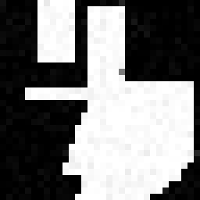

<div align="center">

# ShapeDreamer

**Watch a neural network dream up geometric shapes in real-time**



[](https://www.python.org/downloads/)
[](https://modal.com/)
[](https://opensource.org/licenses/MIT)

[Live Demo](#live-demo) | [Quick Start](#quick-start) | [How It Works](#how-it-works) | [Train Your Own](#training)

</div>

---

An educational **DDPM (Denoising Diffusion Probabilistic Model)** that generates 32x32 pixel art of geometric shapes. Heavily commented code, simple dataset, instant results.

## Live Demo

Stream continuously evolving shapes from an A100 GPU:

```bash
modal serve modal_app/live_diffusion.py
```

Then open the printed URL. Use the **creativity slider** to control how much shapes morph between frames.

> **Speed:** DDIM sampling (20 steps) + FP16 = **~10x faster** than vanilla DDPM

---

## Quick Start

```bash
# Clone & install
git clone https://github.com/Eyali1001/shapedreamer.git
cd shapedreamer
uv sync

# Train locally (5 min on GPU, 30 min on M1 Mac)
uv run scripts/train_local.py --epochs 100

# Generate samples
uv run scripts/sample.py --checkpoint checkpoints/best.pt --show-process
```

### Cloud Training (Recommended)

Train on Modal's A100 GPUs for fastest results:

```bash
modal run modal_app/train.py --epochs 100 --batch-size 128
modal volume get diffusion-checkpoints best.pt ./checkpoints/
```

---

## What You'll Learn

| Concept | Where to Look |
|---------|---------------|
| Forward diffusion (adding noise) | `src/model/diffusion.py` |
| Reverse diffusion (denoising) | `src/model/diffusion.py` |
| U-Net architecture | `src/model/unet.py` |
| Sinusoidal time embeddings | `src/model/embeddings.py` |
| Self-attention blocks | `src/model/blocks.py` |
| DDIM fast sampling | `modal_app/live_diffusion.py` |

---

## How It Works

### The Math (Simplified)

**Forward Process** — Gradually add noise:
```
x_t = sqrt(ᾱ_t) · x_0 + sqrt(1-ᾱ_t) · ε
```

**Reverse Process** — Learn to denoise:
```
x_{t-1} = (1/sqrt(α_t)) · (x_t - (β_t/sqrt(1-ᾱ_t)) · ε_θ(x_t, t)) + σ_t · z
```

The neural network predicts noise **ε** at each timestep. That's it!

### Architecture

```
Input (32×32) → Encoder → Bottleneck → Decoder → Predicted Noise (32×32)
                  ↓           ↓           ↑
            [64→128→256]   [512ch]   [256→128→64]
                  ↓           ↓           ↑
              + Time Embedding + Attention at every scale
```

---

## Training

### Expected Results

| Stage | Loss | Samples Look Like |
|-------|------|-------------------|
| Epoch 1-10 | ~0.5 | Pure noise |
| Epoch 20-50 | ~0.1 | Blurry blobs |
| Epoch 50-100 | ~0.02 | Clean shapes! |

### Configuration

| Parameter | Default | Description |
|-----------|---------|-------------|
| `--epochs` | 100 | Training epochs |
| `--samples` | 10000 | Dataset size |
| `--batch-size` | 64 | Batch size |
| `--lr` | 2e-4 | Learning rate |

---

## Project Structure

```
shapedreamer/
├── src/model/          # Neural network components
│   ├── unet.py         # U-Net architecture
│   ├── blocks.py       # ResBlock, Attention, Up/Down
│   ├── embeddings.py   # Time embeddings
│   └── diffusion.py    # DDPM forward/reverse
├── src/data/           # Synthetic shape generator
├── scripts/            # Training & sampling
└── modal_app/          # Cloud GPU deployment
```

---

## Troubleshooting

| Problem | Solution |
|---------|----------|
| Out of memory | Reduce `--batch-size` to 16 |
| Slow training | Use Modal cloud GPUs |
| Blurry samples | Train more epochs |
| No shapes visible | Check loss is decreasing |

---

## Further Reading

- [DDPM Paper](https://arxiv.org/abs/2006.11239) — The original
- [Understanding Diffusion Models](https://arxiv.org/abs/2208.11970) — Great tutorial
- [Annotated Diffusion](https://huggingface.co/blog/annotated-diffusion) — Code walkthrough

---

<div align="center">

**MIT License** · Built for learning

</div>
